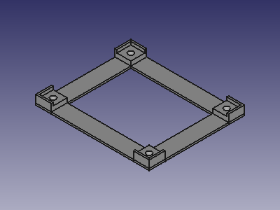

# PCB bracket generator for FreeCAD

Python script for FreeCAD to generate a simple PCB bracket.

## Bracket for 50x60mm PCB

PCB bracket for the Traintastic LocoNet Servo 12 module.

[Download FreeCAD drawing](https://github.com/traintastic/pcb-bracket-generator/raw/master/output/pcb_bracket_50x60.FCStd) | [Download STL]([output](https://github.com/traintastic/pcb-bracket-generator/raw/master/output/)https://github.com/traintastic/pcb-bracket-generator/raw/master/output/pcb_bracket_50x60.std)
